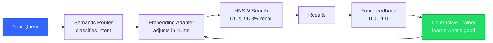
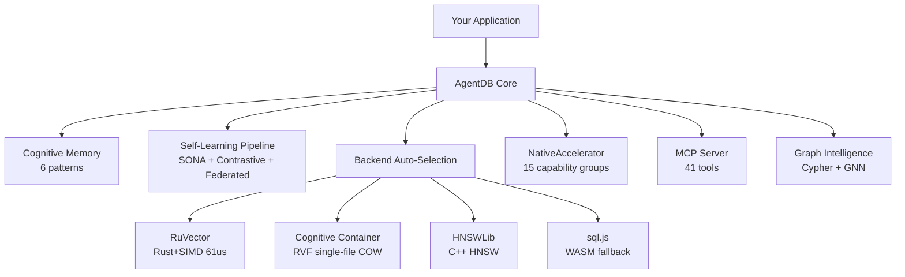
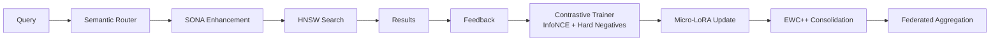
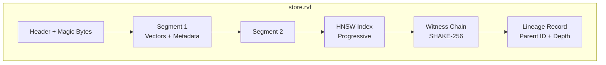
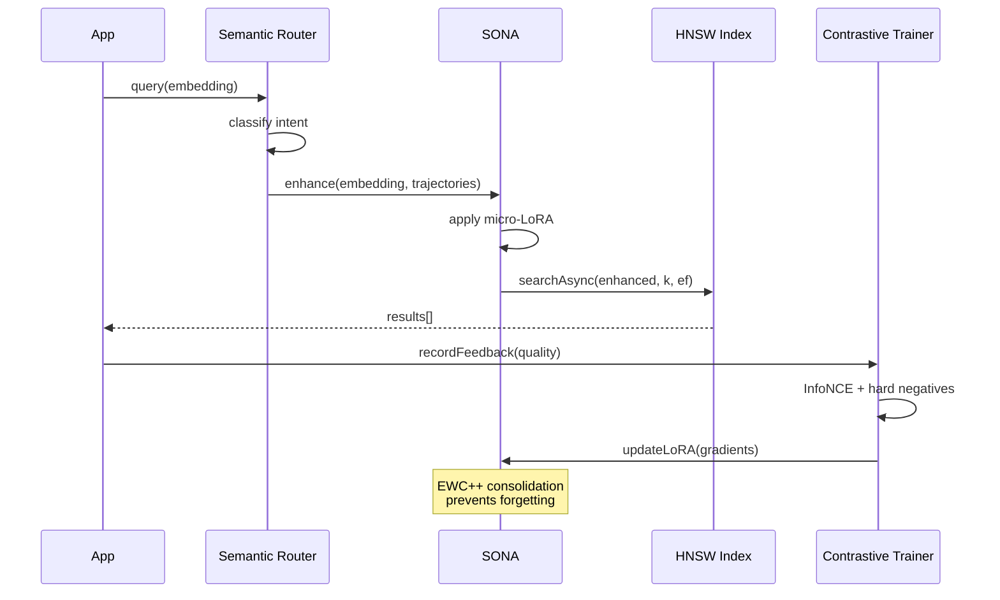

# AgentDB v3

> Intelligent agentic vector database — learns from experience, optimizes itself, runs anywhere

[](https://www.npmjs.com/package/agentdb)
[](https://www.npmjs.com/package/agentdb)
[](LICENSE)
[](https://www.typescriptlang.org/)
[](docs/guides/)

---

## What is AgentDB?

**AgentDB is a vector database that gets smarter every time you use it.**

Most vector databases store and retrieve embeddings. AgentDB does that too — 150x faster — but it also watches which results your AI agent actually used, learns from that feedback, and returns better results next time. Search quality improves by up to **36% automatically**, with zero manual tuning.

Everything lives in a **single Cognitive Container** (`.rvf` file) — vectors, indexes, learning state, and a cryptographic audit trail. No external services. No API keys. No monthly bills.

> **3 lines to self-learning search:**
>
> ```typescript
> const backend = await SelfLearningRvfBackend.create({
>   learning: true,
>   storagePath: "./my.rvf",
> });
> const results = await backend.searchAsync(query, 10); // search
> backend.recordFeedback("q1", 0.9); // learn — next search is smarter
> ```

### Who is it for?

| If you're building...        | AgentDB gives you...                                                                              |
| ---------------------------- | ------------------------------------------------------------------------------------------------- |
| **A RAG chatbot**            | Search that learns which documents actually answer user questions                                 |
| **A code review agent**      | Pattern memory that remembers what worked across 1000s of reviews                                 |
| **A research assistant**     | Skill library that builds reusable tools from successful strategies                               |
| **An RL-powered agent**      | 9 algorithms from Q-Learning to PPO, with bandit-guided algorithm selection and transfer learning |
| **A Claude Code / MCP tool** | 41 tools that plug in with one command                                                            |
| **An offline or edge app**   | Full vector DB in the browser via WASM — no server needed                                         |
| **An enterprise platform**   | JWT auth, API key rotation, Argon2id hashing, SOC2/GDPR audit logs                                |

---

## Features

### Intelligence

|                           |                                                                                                                  |
| ------------------------- | ---------------------------------------------------------------------------------------------------------------- |
| **Self-Learning Search**  | Gets 36% better over time — learns from feedback, no manual tuning                                               |
| **Cognitive Memory**      | 6 human-inspired patterns: learn from mistakes, build reusable skills, discover what causes what                 |
| **Decision Intelligence** | Thompson Sampling bandit auto-tunes skill selection, pattern ranking, compression tiers, and RL algorithm choice |
| **9 RL Algorithms**       | Q-Learning, SARSA, DQN, PPO, Actor-Critic, Policy Gradient, Decision Transformer, MCTS, Model-Based RL           |
| **Hybrid Search**         | BM25 keyword + vector with Reciprocal Rank Fusion — exact matches + semantic understanding                       |
| **Graph Intelligence**    | Cypher queries, causal reasoning, GNN 8-head attention (+12.4% recall)                                           |

### Performance

|                   |                                                                                    |
| ----------------- | ---------------------------------------------------------------------------------- |
| **150x Faster**   | 61us search with Rust+SIMD — 800x faster than Pinecone, 160x faster than Chroma    |
| **4 Backends**    | Auto-selects best available: RuVector (Rust) > RVF > HNSWLib (C++) > sql.js (WASM) |
| **Runs Anywhere** | Node.js, browsers (WASM), edge functions, fully offline                            |
| **AgentDBFast**   | 50-200x faster programmatic API — skip CLI overhead for production workloads       |

### Storage & Data

|                               |                                                                                            |
| ----------------------------- | ------------------------------------------------------------------------------------------ |
| **Cognitive Container (RVF)** | Single `.rvf` file — vectors, index, learning state, SHAKE-256 witness chain               |
| **COW Branching**             | Instant copy-on-write branches for experiments, with full lineage tracking                 |
| **Compression**               | 5-tier auto-tiering (hot/warm/cool/cold/archive), scalar 8-bit/4-bit, product quantization |
| **Metadata Filtering**        | 10 MongoDB-style operators ($eq, $gt, $in, $contains, $exists, etc.)                       |

### Integration & Tools

|                    |                                                                                            |
| ------------------ | ------------------------------------------------------------------------------------------ |
| **41 MCP Tools**   | One command to connect to Claude Code, Cursor, or any MCP-compatible assistant             |
| **Chat UI**        | `@agentdb/chat` — deploy a self-learning RAG chatbot in one line                           |
| **LLM Router**     | Auto-selects best provider: RuvLLM (local), OpenRouter (200+ models), Gemini, Claude, ONNX |
| **Real-Time Sync** | QUIC transport, multi-instance replication, 4 conflict resolution strategies               |

### Enterprise & Security

|                   |                                                                                             |
| ----------------- | ------------------------------------------------------------------------------------------- |
| **Auth & Audit**  | JWT tokens, Argon2id hashing, API key rotation, SOC2/GDPR/HIPAA logging                     |
| **Security**      | Input validation, XSS/injection prevention, Cypher sanitization, witness chain verification |
| **Observability** | OpenTelemetry traces, Prometheus metrics, structured logging                                |
| **Benchmarking**  | 5 built-in benchmarks, custom benchmark classes, Markdown/JSON reports                      |

> **Zero config, zero cost.** `npm install agentdb` and go — fully local, no API keys, no cloud fees.

### Install

```bash
npm install agentdb          # Latest stable (v2)
npm install agentdb@alpha    # Latest alpha (v3 — unified .rvf, self-learning, SolverBandit)
```

**Zero native dependencies.** AgentDB uses sql.js (WASM SQLite) — no Python, no C++ compiler, no `node-gyp`. Works on Windows, macOS, Linux, and CI containers out of the box. `better-sqlite3` is supported as an optional performance upgrade but never required.

---

## Comparison

> **61 microseconds.** That's 800x faster than Pinecone, 160x faster than Chroma, and the only vector database that learns from your usage and gets better over time.

### vs. Other Vector Databases

#### Intelligence

| Feature                | AgentDB v3                              | Pinecone | Chroma | Weaviate  | pgvector |
| ---------------------- | --------------------------------------- | -------- | ------ | --------- | -------- |
| Self-learning pipeline | SONA + contrastive + federated + bandit | No       | No     | No        | No       |
| Reinforcement learning | 9 algorithms (Q-Learning to MCTS)       | No       | No     | No        | No       |
| Cognitive memory       | 6 patterns                              | No       | No     | No        | No       |
| Hybrid search          | BM25 + vector (RRF fusion)              | No       | No     | BM25 only | No       |
| Graph queries          | Cypher                                  | No       | No     | GraphQL   | No       |

#### Performance & Deployment

| Feature        | AgentDB v3 | Pinecone | Chroma | Weaviate | pgvector |
| -------------- | ---------- | -------- | ------ | -------- | -------- |
| Search latency | **61us**   | ~50ms    | ~10ms  | ~5ms     | ~2ms     |
| Runs offline   | Full       | No       | Yes    | Yes      | Yes      |
| Browser (WASM) | Yes        | No       | No     | No       | No       |

#### Storage

| Feature             | AgentDB v3                         | Pinecone | Chroma | Weaviate | pgvector |
| ------------------- | ---------------------------------- | -------- | ------ | -------- | -------- |
| Cognitive Container | Single `.rvf` file + COW branching | No       | No     | No       | No       |
| Monthly cost        | **$0**                             | $70+     | $0     | $0+      | $0+      |

#### Integration & Security

| Feature         | AgentDB v3                       | Pinecone   | Chroma | Weaviate  | pgvector |
| --------------- | -------------------------------- | ---------- | ------ | --------- | -------- |
| MCP integration | 41 tools                         | No         | No     | No        | No       |
| Auth & audit    | JWT + Argon2id + compliance logs | No         | No     | No        | No       |
| Local-first     | Yes                              | Cloud only | Yes    | Self-host | Postgres |

### Backend Performance

| Backend                       | Latency | Recall@10 | Native | Best For                     |
| ----------------------------- | ------- | --------- | ------ | ---------------------------- |
| **RuVector** (Rust + SIMD)    | 61us    | 96.8%     | Yes    | Production, high throughput  |
| **Cognitive Container** (RVF) | ~100us  | 96.8%     | Yes    | Portable, branching, lineage |
| **HNSWLib** (C++)             | ~500us  | 95%+      | Yes    | Compatibility                |
| **sql.js** (WASM)             | ~5ms    | 90%+      | No     | Zero-dependency fallback     |

AgentDB auto-selects the best available: RuVector > Cognitive Container (RVF) > HNSWLib > sql.js

---

## Quick Start

```bash
npm install agentdb
```

### Unified AgentDB (recommended)

The `AgentDB` class is the simplest way to use AgentDB. Everything — vectors, relational data, learning state — lives in a single `.rvf` file:

```typescript
import { AgentDB } from "agentdb";

const db = new AgentDB({ dbPath: "./knowledge.rvf" });
await db.initialize();

// All controllers are ready — reflexion memory, skill library, causal graph
const reflexion = db.getController("reflexion");
const skills = db.getController("skills");
const causal = db.getController("causal");

// Store an episode
await reflexion.storeEpisode({
  sessionId: "session-1",
  task: "Fix auth bug",
  reward: 0.95,
  success: true,
  critique: "OAuth2 PKCE was the right approach",
});

// Create a reusable skill
await skills.createSkill({
  name: "jwt_auth",
  description: "JWT authentication with refresh tokens",
  code: "implementation...",
  successRate: 0.92,
});

// Save everything to one file and close
await db.save();
await db.close();
```

**Configuration options:**

| Option            | Default      | Description                                                                                |
| ----------------- | ------------ | ------------------------------------------------------------------------------------------ |
| `dbPath`          | `':memory:'` | Path to `.rvf` file (or `.db` for legacy mode)                                             |
| `vectorBackend`   | `'rvf'`      | Backend: `'rvf'` (unified), `'auto'`, `'ruvector'`, `'hnswlib'`                            |
| `vectorDimension` | `384`        | Embedding dimension (384 for MiniLM, 768 for bge-base)                                     |
| `forceWasm`       | `false`      | Force sql.js WASM backend (sql.js is the default; `better-sqlite3` used only if installed) |
| `enableAttention` | `false`      | Enable GNN attention mechanisms                                                            |

**Controllers:** `db.getController('reflexion')` (ReflexionMemory), `db.getController('skills')` (SkillLibrary), `db.getController('causal')` (CausalMemoryGraph)

### CLI — try it in 10 seconds

```bash
npx agentdb init                                    # Initialize a new database
npx agentdb doctor                                  # Check system health
npx agentdb rvf status ./store.rvf                  # Inspect a Cognitive Container
npx agentdb rvf derive ./prod.rvf ./experiment.rvf  # Branch for experiments (instant, COW)
npx agentdb mcp start                               # Start MCP server (41 tools)
npx @agentdb/chat serve --rvf ./kb.rvf --port 3000  # Launch chat UI
```

<details>
<summary><strong>Complete CLI Reference</strong> — 60+ commands across 8 categories</summary>

#### Core

```bash
npx agentdb init                          # Initialize database
npx agentdb status                        # System status and diagnostics
npx agentdb doctor [--fix] [--verbose]    # Health check with auto-fix
```

#### Cognitive Container (RVF) Management

```bash
npx agentdb rvf status ./store.rvf        # Container statistics
npx agentdb rvf compact ./store.rvf       # Reclaim space
npx agentdb rvf derive ./src.rvf ./dst.rvf # COW branch
npx agentdb rvf segments ./store.rvf      # Segment introspection
npx agentdb rvf detect                    # SDK availability
```

#### Learning & Training

```bash
npx agentdb learn --session <id> --train  # Train a learning session
npx agentdb learn --status                # Learning system status
```

#### Routing

```bash
npx agentdb route --query "search term"   # Test semantic routing
npx agentdb route --list                  # Show learned intents
```

#### Attention & Hyperbolic

```bash
npx agentdb attention --benchmark         # Attention performance test
npx agentdb hyperbolic --test             # Hyperbolic embedding test
```

#### Simulation

```bash
npx agentdb simulate hnsw --iterations 3           # HNSW optimization
npx agentdb simulate attention --iterations 3       # GNN attention
npx agentdb simulate self-organizing --days 30      # Self-healing
npx agentdb simulate --wizard                       # Interactive wizard
npx agentdb simulate --custom ./my-scenario.json    # Custom simulation
npx agentdb simulate --report ./output.md           # Generate report
```

#### Migration & Import

```bash
npx agentdb migrate --source ./old.db --target ./new.db  # Full v1→v2 migration
npx agentdb migrate --source ./v2.db --to v3 --rvf-path ./unified.rvf  # v2→v3 unified .rvf
npx agentdb migrate --to rvf --rvf-path ./out.rvf        # Export to Cognitive Container
npx agentdb migrate --dry-run --verbose                   # Preview changes
```

#### MCP Server

```bash
npx agentdb mcp start                    # Start MCP server (41 tools)
npx agentdb mcp start --port 8080        # Custom port
```

</details>

### Self-Learning Vector Search (the differentiator)

Most vector databases return the same results no matter how many times you query them. AgentDB closes the loop: after every search, you tell it which results were actually useful. A contrastive trainer (InfoNCE + hard-negative mining) adjusts a lightweight LoRA adapter in under 1 ms, and EWC++ consolidation keeps old knowledge intact. Over 500 feedback cycles, recall jumps from 54% to 90% — automatically.

```typescript
import { SelfLearningRvfBackend } from "agentdb/backends/rvf/SelfLearningRvfBackend";

// Create a self-learning Cognitive Container
const backend = await SelfLearningRvfBackend.create({
  dimension: 384,
  metric: "cosine",
  storagePath: "./knowledge.rvf",
  learning: true, // enable the learning pipeline
});

// Insert documents
await backend.insertAsync("doc-1", embedding, { title: "Auth Guide" });
await backend.insertAsync("doc-2", embedding2, { title: "API Reference" });

// Search — automatically routed through the learning pipeline
const results = await backend.searchAsync(queryEmbedding, 10);

// Tell AgentDB which results were useful — this drives learning
backend.recordFeedback("query-1", 0.95); // great result
backend.recordFeedback("query-2", 0.2); // poor result

// Run a learning tick — trains the model, updates adapters
await backend.tick();
// Next search will be smarter based on your feedback
```

### Cognitive Memory (pattern learning)

Store and retrieve reasoning patterns — your agent remembers what worked:

```typescript
import { createDatabase, ReasoningBank, EmbeddingService } from "agentdb";

const db = await createDatabase("./agent-memory.db");
const embedder = new EmbeddingService({ model: "Xenova/all-MiniLM-L6-v2" });
await embedder.initialize();

const reasoningBank = new ReasoningBank(db, embedder);

// Store what your agent learned
await reasoningBank.storePattern({
  taskType: "code_review",
  approach: "Security-first analysis",
  successRate: 0.95,
});

// Find similar successful patterns
const patterns = await reasoningBank.searchPatterns({
  task: "security code review",
  k: 10,
});
```

### Unified Mode — Everything in One File

In v3, `AgentDB` stores vectors, relational data, learning state, and metadata in a single `.rvf` file:

```typescript
import { AgentDB } from "agentdb";

// Single-file mode is the default — no configuration needed
const db = new AgentDB({ dbPath: "./agent.rvf" });
await db.initialize();

// Access the underlying database for advanced queries
const raw = db.database;
const stats = raw.prepare("SELECT COUNT(*) as c FROM episodes").get();

// Check mode
console.log(db.isUnifiedMode); // true — everything in one .rvf file
console.log(db.vectorBackendName); // 'rvf'

// Save and reopen — all data persists in agent.rvf
await db.save();
await db.close();

const db2 = new AgentDB({ dbPath: "./agent.rvf" });
await db2.initialize(); // All episodes, skills, vectors restored
```

### Chat UI (one-line deployment)

Deploy a self-learning RAG chatbot over any Cognitive Container:

```bash
npx @agentdb/chat serve --rvf ./kb.rvf --port 3000
```

---

## How the Learning Loop Works

Every search automatically triggers a learning cycle. No configuration needed — just call `recordFeedback()` after using results:



> **Result:** Over 10 sessions with 50 episodes each, search quality improved from 54% to 90% — a 36% gain with zero manual tuning.

## Architecture



---

## MCP Integration

> **One command** to give any AI assistant access to self-learning vector search, cognitive memory, and 37 specialized tools.

Connect AgentDB to Claude Code, Cursor, or any MCP-compatible AI assistant:

```bash
claude mcp add agentdb npx agentdb mcp start
```

Or add to `~/.config/claude/claude_desktop_config.json`:

```json
{
  "mcpServers": {
    "agentdb": {
      "command": "npx",
      "args": ["agentdb", "mcp", "start"],
      "env": { "AGENTDB_PATH": "./agentdb.rvf" }
    }
  }
}
```

### MCP Tools Overview

| Category     | Tools | Examples                                                                                         |
| ------------ | ----- | ------------------------------------------------------------------------------------------------ |
| **Core DB**  | 6     | init, insert, batch insert, search, delete, stats                                                |
| **Patterns** | 4     | store, search, batch store, statistics                                                           |
| **Memory**   | 9     | reflexion store/retrieve/batch, skill create/search/batch, causal edges/queries, nightly learner |
| **Learning** | 10    | RL sessions, predictions, feedback, training, transfer learning, explainability                  |
| **Recall**   | 2     | explainable recall with provenance certificates, cache management                                |
| **Solver**   | 4     | solver train, acceptance testing, policy inspection, witness chain audit                         |
| **Admin**    | 6     | diagnostics, migration, pruning, experience recording, reward signals, legacy stats              |

All 41 tools support parallel execution markers, batch operations, intelligent caching, and format parameters for token reduction.

---

## Chat Ecosystem

The `@agentdb/chat` package provides a one-line chat UI with self-learning RAG built on top of AgentDB:

```bash
# Serve a chat interface over your knowledge base
npx @agentdb/chat serve --rvf ./kb.rvf --port 3000
```

Programmatic usage:

```typescript
import { createChatServer } from "@agentdb/chat";

const server = await createChatServer("./kb.rvf", {
  port: 3000,
  learning: true,
});
```

The chat ecosystem includes:

- **Chat Server** — streaming inference with any LLM provider
- **Chat Persistence** — conversation history stored in Cognitive Containers
- **MCP Bridge** — expose all 37 AgentDB tools through chat
- **Chat UI** (`@agentdb/chat-ui`) — SvelteKit frontend with real-time tool invocation

See the [@agentdb/chat README](../agentdb-chat/README.md) for full documentation.

---

## Deep Dives

> Expand any section below for code examples, configuration, and architecture details.

**Getting Started** | [Guides](#guides) | [Tutorials](#tutorials) | [Advanced Usage](#advanced-usage)

**Intelligence & Learning** | [Self-Learning Pipeline](#self-learning-pipeline) | [Cognitive Memory](#cognitive-memory-patterns) | [Reinforcement Learning](#reinforcement-learning) | [Hybrid Search](#hybrid-search) | [Graph Intelligence](#graph-intelligence) | [Query Lifecycle](#query-lifecycle)

**Performance & Architecture** | [SIMD Acceleration](#simd--native-acceleration) | [Browser & WASM](#browser--wasm-deployment) | [Benchmarks](#performance--benchmarks) | [AgentDBFast](#agentdbfast) | [Benchmark Suite](#benchmark-suite)

**Storage & Data** | [Cognitive Container (RVF)](#cognitive-container-rvf-format) | [Quantization](#quantization--compression) | [Metadata Filtering](#metadata-filtering)

**Integration & Tools** | [LLM Router](#llm-router) | [Model Import/Export](#model-importexport--embedding-models) | [Multi-Database Sync](#multi-database-coordination) | [Real-Time Sync](#real-time-sync-quic)

**Enterprise & Security** | [Security](#security) | [Auth & Audit](#auth--audit) | [Observability](#observability)

---

### Getting Started

Step-by-step guides, tutorials, and advanced configuration for every skill level.

<details>
<summary><strong>Guides</strong> — backend selection, migration, health checks, federated learning</summary>

#### Backend Selection

```bash
# Auto-detect best backend (recommended)
npx agentdb init --backend auto

# Force RuVector (fastest, requires native bindings)
npx agentdb init --backend ruvector

# Force Cognitive Container (single-file, portable)
npx agentdb init --backend rvf --rvf-path ./vectors.rvf

# Force HNSWLib (C++ HNSW)
npx agentdb init --backend hnswlib
```

#### Migration

```bash
# Migrate v1 → v2
npx agentdb migrate --source ./old.db --target ./new.db

# Migrate v2 → v3 unified .rvf (same schemas, data copy)
npx agentdb migrate --source ./v2.db --to v3 --rvf-path ./unified.rvf

# Export to Cognitive Container
npx agentdb migrate --to rvf --rvf-path ./vectors.rvf

# Dry-run migration
npx agentdb migrate --dry-run --verbose
```

#### Health Checks

```bash
# Full diagnostic
npx agentdb doctor --verbose

# Check specific Cognitive Container
npx agentdb doctor --rvf-path ./vectors.rvf

# Auto-fix issues
npx agentdb doctor --fix
```

#### Federated Learning Setup

Configure cross-session federated learning for continuous improvement:

```typescript
import {
  FederatedLearningCoordinator,
  EphemeralLearningAgent,
} from "agentdb/services/federated-learning";

const coordinator = new FederatedLearningCoordinator({
  agentId: "coordinator-1",
  minQuality: 0.7,
  maxAgents: 100,
});

const agent = new EphemeralLearningAgent({
  agentId: "session-agent-1",
  qualityFiltering: true,
});

const state = agent.exportState();
await coordinator.aggregate(state);
const merged = await coordinator.consolidate();
```

</details>

---

<details>
<summary><strong>Tutorials</strong> — 6 step-by-step walkthroughs from beginner to advanced</summary>

#### Tutorial 1: Build a Learning Code Review Agent

```typescript
import {
  createDatabase,
  ReasoningBank,
  ReflexionMemory,
  EmbeddingService,
} from "agentdb";

const db = await createDatabase("./code-reviewer.db");
const embedder = new EmbeddingService({ model: "Xenova/all-MiniLM-L6-v2" });
await embedder.initialize();

const reasoningBank = new ReasoningBank(db, embedder);
const reflexion = new ReflexionMemory(db, embedder);

await reasoningBank.storePattern({
  taskType: "code_review",
  approach: "Security scan > Type safety > Code quality > Performance",
  successRate: 0.94,
});

const result = await performCodeReview(code);
await reflexion.storeEpisode({
  sessionId: "review-1",
  task: "Review authentication PR",
  reward: result.issuesFound > 0 ? 0.9 : 0.6,
  success: true,
  critique: "Found SQL injection — security checks work!",
  input: code,
  output: result.findings,
});

const pastReviews = await reflexion.retrieveRelevant({
  task: "authentication code review",
  k: 5,
  onlySuccesses: true,
});
```

#### Tutorial 2: RAG with Self-Learning Skills

```typescript
import { createDatabase, SkillLibrary, EmbeddingService } from "agentdb";

const db = await createDatabase("./rag-system.db");
const embedder = new EmbeddingService({ model: "Xenova/all-MiniLM-L6-v2" });
await embedder.initialize();

const skills = new SkillLibrary(db, embedder);

await skills.createSkill({
  name: "expand_query",
  description: "Expand user query with domain-specific synonyms",
  signature: { inputs: { query: "string" }, outputs: { expanded: "string[]" } },
  code: `const map = { 'bug': ['issue', 'defect', 'error'] }; ...`,
  successRate: 0.92,
});

const applicable = await skills.searchSkills({
  task: "find technical documentation",
  k: 10,
});
```

#### Tutorial 3: Run Latent Space Simulations

```bash
npx agentdb simulate hnsw --iterations 3
npx agentdb simulate attention --iterations 3
npx agentdb simulate self-organizing --days 30
npx agentdb simulate --wizard
```

#### Tutorial 4: Cognitive Container Branching

```typescript
import { RvfBackend } from "agentdb/backends/rvf/RvfBackend";

const main = new RvfBackend({
  dimension: 384,
  metric: "cosine",
  storagePath: "./main.rvf",
});
await main.initialize();
await main.insertAsync("doc-1", embedding1, { source: "production" });
await main.flush();

// Branch for experiment (copy-on-write, near-instant)
const experiment = await main.derive("./experiment.rvf");
await experiment.insertAsync("doc-exp-1", experimentEmbedding);
console.log(`Lineage depth: ${await experiment.lineageDepth()}`);
```

#### Tutorial 5: Self-Learning RAG Pipeline

```typescript
import { SelfLearningRvfBackend } from "agentdb/backends/rvf/SelfLearningRvfBackend";

const backend = await SelfLearningRvfBackend.create({
  dimension: 384,
  metric: "cosine",
  storagePath: "./rag-vectors.rvf",
  learning: true,
  federated: true,
});

for (const doc of documents) {
  await backend.insertAsync(doc.id, doc.embedding, { title: doc.title });
}

const results = await backend.searchAsync(queryEmbedding, 10);
backend.recordFeedback("query-1", 0.95);
await backend.tick();
```

#### Tutorial 6: Chat UI with Custom Knowledge Base

```bash
npx agentdb init --backend rvf --rvf-path ./docs.rvf
npx agentdb import ./docs/ --rvf-path ./docs.rvf
npx @agentdb/chat serve --rvf ./docs.rvf --port 3000
```

</details>

---

<details>
<summary><strong>Advanced Usage</strong> — batch ops, caching, solver tuning, GNN training, context synthesis</summary>

#### Batch Operations

```typescript
import { BatchOperations } from "agentdb/optimizations/BatchOperations";

const batchOps = new BatchOperations(db, embedder, {
  batchSize: 100,
  parallelism: 4,
  progressCallback: (done, total) => console.log(`${done}/${total}`),
});

await batchOps.insertSkills([...skills]);
await batchOps.insertEpisodes([...episodes]);
await batchOps.insertPatterns([...patterns]);
```

#### Custom Backend Selection

```typescript
import { createBackend, detectBackends } from "agentdb/backends/factory";

const detection = await detectBackends();
// { ruvector: { available, native, gnn }, rvf: { sdk, node, wasm }, hnswlib: { available } }

const backend = await createBackend({
  type: "rvf",
  dimension: 384,
  metric: "cosine",
  storagePath: "./vectors.rvf",
});
```

#### Adaptive Index Tuning

```typescript
import { AgentDBSolver } from "agentdb/backends/rvf/RvfSolver";

const solver = await AgentDBSolver.create();
const trainResult = solver.train({
  count: 50,
  minDifficulty: 1,
  maxDifficulty: 10,
});
const policy = solver.policy();
// 18 context buckets (3 range x 3 distractor x 2 noise)
```

#### Federated Session Manager

```typescript
import {
  FederatedLearningCoordinator,
  EphemeralLearningAgent,
} from "agentdb/services/federated-learning";

const coordinator = new FederatedLearningCoordinator({
  agentId: "coord-main",
  minQuality: 0.7,
  maxAgents: 100,
});
const sessionAgent = new EphemeralLearningAgent({
  agentId: `session-${Date.now()}`,
  qualityFiltering: true,
});

await sessionAgent.processTask(embedding, 0.9);
const state = sessionAgent.exportState();
await coordinator.aggregate(state);
const merged = await coordinator.consolidate();
```

#### Context Synthesizer

```typescript
import { ContextSynthesizer } from "agentdb/controllers/ContextSynthesizer";

const synthesizer = new ContextSynthesizer();
const context = await synthesizer.synthesize(memories);
// { summary, patterns, successRate, averageReward, recommendations, keyInsights }
```

#### GNN Learning Backend

```typescript
import { LearningBackend } from "agentdb/backends/LearningBackend";

const learner = new LearningBackend({ dimension: 384 });
const enhanced = learner.enhance(queryEmbedding, neighborEmbeddings, weights);
learner.addSample(embedding, "positive", 1.0, { source: "feedback" });
const result = await learner.train(10);
// { epochs: 10, finalLoss: 0.023, improvement: 15.2, durationMs: 340 }
```

</details>

---

### Intelligence & Learning

How AgentDB learns, reasons, and improves over time — from self-learning search to reinforcement learning and causal graphs.

<details>
<summary><strong>Self-Learning Pipeline</strong> — how search improves 36% automatically</summary>

AgentDB's self-learning pipeline continuously improves search quality through a six-phase cycle:



### 1. Semantic Query Routing

The `SemanticQueryRouter` classifies query intent by comparing against learned intent centroids using efficient min-heap top-k selection (O(n log k)). It lazily loads `@ruvector/router` for sub-millisecond HNSW routing and falls back to brute-force cosine with pre-computed norms when native bindings aren't available.

The router also selects the adaptive ef-search arm for the query. Four ef-search levels (50, 100, 200, 400) are chosen based on the solver's Thompson Sampling policy for the matching context bucket.

```typescript
// Router learns intents from usage patterns
router.addIntent("technical_search", embedding); // up to 100 exemplars per intent
router.addIntent("conversational", embedding);
const { intent, confidence } = await router.route(queryEmbedding, k);

// Router state persists across restarts (debounced 5s save)
// Max 1,000 intents, JSON fallback or native persistence
```

### 2. SONA Enhancement

Context enrichment from trajectory history. The SONA engine (`@ruvector/sona`) tracks query trajectories and enriches embeddings with session context before search. SONA also applies the base LoRA adapter to the query embedding, adjusting it in sub-millisecond time based on learned patterns.

### 3. Contrastive Training

InfoNCE contrastive loss with hard negative mining inspired by NV-Retriever's positive-aware filtering:

- **Loss function:** `L = -log(exp(sim(anchor, positive) / τ) / Σ exp(sim(anchor, negative_i) / τ))`
- **Hard negative filtering:** Rejects candidates where `sim(candidate, positive) > 0.85`, eliminating ~70% of false negatives
- **3-stage curriculum:** Progressively increases difficulty — negatives per sample (4 → 8 → 16), hardness threshold (0.5 → 0.3 → 0.1), 100 batches per stage
- **AdamW optimizer:** β1=0.9, β2=0.999, decoupled weight decay, full bias correction
- **Temperature:** Bounded 0.01-1.0 (default: 0.07)

```typescript
// ContrastiveTrainer handles hard negative mining automatically
const result = trainer.trainBatch([
  {
    anchor: queryEmb,
    positive: goodResultEmb,
    negatives: [badResult1, badResult2],
  },
]);
// result: { loss, gradients, batchSize }
```

When native SIMD is available, cosine similarity and AdamW steps delegate to the NativeAccelerator for hardware-accelerated computation.

### 4. Micro-LoRA Adaptation

Sub-millisecond embedding adjustment per query. A lightweight projection matrix (W: d×d + bias: d) is applied to the query embedding before search, specializing for each user's query patterns without modifying the base model. LoRA adapters are updated after each contrastive training batch.

### 5. EWC++ Consolidation

Elastic Weight Consolidation prevents catastrophic forgetting by penalizing changes to important parameters. The Fisher information matrix is updated incrementally via the NativeAccelerator's `ewcUpdateFisher()` and penalty is computed via `ewcPenalty()`, ensuring previously learned patterns survive new training.

### 6. Federated Session Aggregation

Cross-session LoRA merging for continuous improvement. Lightweight `EphemeralLearningAgent` instances (~5MB each) export their state to a `FederatedLearningCoordinator` for quality-filtered aggregation (minimum quality threshold: 0.7, up to 100 agents).

### How `tick()` Works

Each learning tick performs these steps in sequence:

1. **Flush SONA** — persist trajectory context
2. **Train contrastive batch** — 32 samples from recorded feedback
3. **Train solver** — 50 puzzles to update Thompson Sampling policy
4. **Decay access frequencies** — multiply by 0.99, prune entries below 0.001 (every 50 ticks)
5. **Update temporal compressor** — adjust compression tiers
6. **Assess health** — latency tracking via health monitor
7. **Consolidate federated state** — merge distributed agent states
8. **Acceptance check** — every 100 ticks, run A/B/C ablation (mode A: fixed heuristic, mode B: compiler-suggested, mode C: learned Thompson Sampling) to validate adaptive ef-search

### Full Example

```typescript
import { SelfLearningRvfBackend } from "agentdb/backends/rvf/SelfLearningRvfBackend";

const backend = await SelfLearningRvfBackend.create({
  dimension: 384,
  metric: "cosine",
  storagePath: "./vectors.rvf",
  learning: true,
  federated: true,
  positiveThreshold: 0.7,
  negativeThreshold: 0.3,
  trainingBatchSize: 32,
  tickIntervalMs: 5000,
});

// Insert vectors
await backend.insertAsync("doc-1", embedding, { source: "docs" });

// Search (automatically enhanced by SONA + router)
const results = await backend.searchAsync(queryEmbedding, 10);

// Record feedback to drive learning
backend.recordFeedback("query-123", 0.9); // high quality result

// Run a learning tick (contrastive training + LoRA update + EWC consolidation)
await backend.tick();

// Check learning progress
const stats = backend.getLearningStats();
console.log(
  `Trajectories: ${stats.trajectoryCount}, LoRA rank: ${stats.loraRank}`,
);
```

</details>

---

<details>
<summary><strong>Cognitive Memory Patterns</strong> — 6 ways your agent learns like a human</summary>

AgentDB implements six cognitive memory patterns inspired by how humans learn:

### 1. ReasoningBank — Pattern Learning

Store successful reasoning patterns and retrieve them by semantic similarity. The system learns which approaches work best for different task types.

```typescript
await reasoningBank.storePattern({
  taskType: "bug_investigation",
  approach: "Check logs > Reproduce > Binary search for root cause",
  successRate: 0.92,
  tags: ["debugging", "systematic"],
});

const patterns = await reasoningBank.searchPatterns({
  task: "debug memory leak",
  k: 10,
  threshold: 0.7,
});
```

### 2. Reflexion Memory — Learn from Experience

Store complete task episodes with self-generated critiques, then replay them to improve future performance. Based on Shinn et al., 2023.

```typescript
await reflexion.storeEpisode({
  sessionId: "session-1",
  task: "Fix authentication bug",
  reward: 0.95,
  success: true,
  critique: "OAuth2 PKCE flow was more secure than basic flow",
  input: "Users cannot log in",
  output: "Working OAuth2 implementation",
  latencyMs: 1200,
  tokensUsed: 500,
});

const similar = await reflexion.retrieveRelevant({
  task: "authentication issues",
  k: 10,
  onlySuccesses: true,
});
```

### 3. Skill Library — Lifelong Learning

Transform successful patterns into reusable, composable skills that improve over time.

```typescript
await skills.createSkill({
  name: "jwt_authentication",
  description: "Generate and validate JWT tokens",
  signature: { inputs: { userId: "string" }, outputs: { token: "string" } },
  code: "implementation...",
  successRate: 0.92,
});

const applicable = await skills.searchSkills({
  task: "user authentication",
  k: 5,
  minSuccessRate: 0.7,
});
```

### 4. Causal Memory Graph — Intervention Causality

Track `p(y|do(x))` using doubly robust estimation. Learn what interventions cause what outcomes.

```typescript
import { CausalMemoryGraph } from "agentdb";

const causalGraph = new CausalMemoryGraph(db);

const experimentId = causalGraph.createExperiment({
  name: "test_error_handling",
  hypothesis: "Try-catch reduces crash rate",
  treatmentId: 123,
  treatmentType: "episode",
  controlId: 124,
  startTime: Date.now(),
  sampleSize: 0,
  status: "running",
});

const { uplift, pValue } = causalGraph.calculateUplift(experimentId);
```

### 5. Explainable Recall — Provenance Certificates

Every retrieval comes with a cryptographic Merkle proof explaining why specific memories were selected.

```typescript
const result = await causalRecall.recall(
  "query-123",
  "How to optimize API response time",
  12,
  ["performance"],
  "internal",
);

console.log(`Certificate: ${result.certificate.id}`);
console.log(`Completeness: ${result.certificate.completenessScore}`);
```

### 6. Nightly Learner — Automated Discovery

Background process that discovers causal patterns, consolidates skills, and prunes low-quality data automatically.

```typescript
const learner = new NightlyLearner(db, embedder);
const discovered = await learner.discover({
  minAttempts: 3,
  minSuccessRate: 0.6,
  minConfidence: 0.7,
  dryRun: false,
});
```

</details>

---

### Storage & Data

How AgentDB stores vectors, manages compression tiers, and provides MongoDB-style filtering — all in a single Cognitive Container.

<details>
<summary><strong>Cognitive Container (RVF Format)</strong> — single-file storage with crash safety and branching</summary>

The **Cognitive Container** is AgentDB's native storage format (`.rvf` — RuVector Format). It packs vectors, indexes, learning state, and a cryptographic witness chain into a single file with crash safety, progressive indexing, and full lineage tracking.

### Structure



### Key Capabilities

| Feature                   | Description                                                               |
| ------------------------- | ------------------------------------------------------------------------- |
| **Single-file**           | Everything in one Cognitive Container (`.rvf`) — vectors, index, metadata |
| **Crash-safe**            | Append-only log with checksums, safe concurrent access                    |
| **COW Branching**         | Create copy-on-write branches for experiments (near-instant)              |
| **Lineage Tracking**      | `fileId()`, `parentId()`, `lineageDepth()` for file-level provenance      |
| **Progressive Indexing**  | 3-layer HNSW quality tiers, index builds incrementally as data arrives    |
| **Witness Chains**        | SHAKE-256 cryptographic verification (73 bytes per entry)                 |
| **Filter Expressions**    | 11 operators for metadata filtering, max 64 depth                         |
| **Auto-Compaction**       | `compact()` reclaims space, reports segments compacted & bytes reclaimed  |
| **Readonly Mode**         | `openReadonly()` for concurrent readers without locks                     |
| **Segment Introspection** | `segments()` returns id, type, and payload length per segment             |
| **Kernel Embedding**      | Embed unikernel images directly into Cognitive Containers                 |
| **eBPF Embedding**        | Embed and extract eBPF bytecode for programmable queries                  |

### Configuration

```typescript
const backend = new RvfBackend({
  dimension: 384,
  metric: "cosine", // 'cosine' | 'l2' | 'dotproduct'
  storagePath: "./vectors.rvf",
  rvfBackend: "auto", // 'auto' | 'node' (N-API) | 'wasm' (browser)
  batchThreshold: 100, // Auto-flush after N sync inserts (1-10,000)
  compression: "none", // 'none' (fp32) | 'scalar' (int8) | 'product' (PQ)
  hardwareProfile: 0, // 0=Generic | 1=Core | 2=Hot | 3=Full
  enableStats: true, // Track insert/search/flush/compaction timing
});
```

**Hardware profiles** tune internal parameters for your deployment:

| Profile     | Level                       | Best For                |
| ----------- | --------------------------- | ----------------------- |
| Generic (0) | Conservative defaults       | Unknown hardware        |
| Core (1)    | Balanced throughput/latency | Developer machines      |
| Hot (2)     | Aggressive caching          | High-throughput servers |
| Full (3)    | Maximum parallelism         | Dedicated vector search |

### Witness Chains

Every mutation is recorded in a tamper-evident SHAKE-256 witness chain (73 bytes per entry). This provides cryptographic proof that data has not been modified after the fact:

```typescript
const result = backend.verifyWitnessChain();
// { valid: true, entries: 1042, algorithm: 'SHAKE-256' }

// Verification uses @ruvector/rvf-wasm: rvf_witness_verify(), rvf_witness_count()
```

### Filter Expressions

RVF supports 11 filter operators for metadata-filtered search. Filters are serialized to a compact field-ID format with a maximum depth of 64 expressions for security:

```typescript
import { FilterBuilder } from "agentdb/backends/rvf/FilterBuilder";

const filter = new FilterBuilder()
  .eq("status", "active")
  .gt("score", 0.5)
  .range("timestamp", startDate, endDate)
  .in("category", ["research", "engineering"])
  .build();

const results = await backend.searchAsync(queryVector, 10, { filter });

// Also supports filter-based deletion
await backend.deleteByFilter(filter);
```

**Available operators:** `eq`, `ne`, `lt`, `le`, `gt`, `ge`, `in`, `range`, `and`, `or`, `not`

### Performance Stats

The RVF backend tracks detailed performance counters:

```typescript
const stats = backend.getPerformanceStats();
// {
//   insertCount: 10432, insertTotalMs: 521.6, avgInsertMs: 0.05,
//   searchCount: 8891,  searchTotalMs: 178.2, avgSearchMs: 0.02,
//   flushCount: 104,    compactionCount: 3
// }
```

### Kernel & eBPF Embedding

Cognitive Containers can embed unikernel images and eBPF bytecode directly, enabling self-contained deployable artifacts:

```typescript
// Embed a kernel image into the Cognitive Container
await backend.embedKernel({
  arch: "x86_64", // 'x86_64' | 'aarch64' | 'riscv64'
  type: "firecracker", // 'firecracker' | 'qemu' | 'cloud-hypervisor'
  flags: 0,
  image: kernelBuffer,
  apiPort: 8080,
  cmdline: "console=ttyS0",
});

// Extract it later
const kernel = await backend.extractKernel();
// { header: { arch, type, ... }, image: Uint8Array }

// eBPF bytecode for programmable query filters
await backend.embedEbpf(ebpfBytecode);
const ebpf = await backend.extractEbpf();
```

### CLI Commands

```bash
# Show store status
npx agentdb rvf status ./store.rvf

# Compact to reclaim space
npx agentdb rvf compact ./store.rvf

# Create a branch (copy-on-write)
npx agentdb rvf derive ./parent.rvf ./experiment.rvf

# List segments
npx agentdb rvf segments ./store.rvf

# Detect SDK availability
npx agentdb rvf detect
```

### Programmatic Usage

```typescript
import { RvfBackend } from "agentdb/backends/rvf/RvfBackend";

const backend = new RvfBackend({
  dimension: 384,
  metric: "cosine",
  storagePath: "./vectors.rvf",
  rvfBackend: "auto", // 'node' for N-API, 'wasm' for browser
});
await backend.initialize();

// Async operations (native)
await backend.insertAsync("vec-1", embedding, { tag: "example" });
const results = await backend.searchAsync(queryVector, 10);
await backend.flush();

// COW branching
const branch = await backend.derive("./experiment.rvf");
const lineage = await backend.lineageDepth();
```

### Backend Selection

```bash
# Initialize with RVF backend
npx agentdb init --backend rvf --rvf-path ./vectors.rvf

# Migrate v2 database to v3 unified .rvf
npx agentdb migrate --source ./v2.db --to v3 --rvf-path ./unified.rvf

# Migrate existing data to RVF
npx agentdb migrate --to rvf --rvf-path ./vectors.rvf

# Check RVF in diagnostics
npx agentdb doctor --rvf-path ./vectors.rvf
```

</details>

---

### Performance & Architecture

The engine behind AgentDB's speed — SIMD acceleration, graph intelligence, browser WASM, and benchmarking.

<details>
<summary><strong>SIMD & Native Acceleration</strong> — 15 capability groups with automatic fallbacks</summary>

The `NativeAccelerator` provides 15 capability groups bridging 11 `@ruvector` packages, with pure-JS fallbacks for every operation via `SimdFallbacks`.

### Capability Groups

| Group                      | Operations                                           | Package                |
| -------------------------- | ---------------------------------------------------- | ---------------------- |
| **Vector Distance & Math** | cosine, dot, L2, hamming, add, mul, scale, normalize | `ruvector`             |
| **Activations**            | softmax, relu, gelu, sigmoid, layerNorm              | `@ruvector/ruvllm`     |
| **Loss Functions**         | InfoNCE (contrastive)                                | `@ruvector/sona`       |
| **Optimizers**             | AdamW step                                           | `@ruvector/sona`       |
| **Quantization**           | scalar 8-bit/4-bit, product quantization             | `@ruvector/rvf`        |
| **WASM Store**             | create, ingest, query, export, close                 | `@ruvector/rvf-wasm`   |
| **Verification**           | witness chain, segment header                        | `@ruvector/rvf-node`   |
| **Graph Transactions**     | begin, commit, rollback                              | `@ruvector/graph-node` |
| **Graph Batch Insert**     | high-throughput node/edge ingestion                  | `@ruvector/graph-node` |
| **Graph Cypher**           | pattern matching, path queries                       | `@ruvector/graph-node` |
| **Core Batch Insert**      | native vector batch ingestion                        | `ruvector`             |
| **EWC Memory**             | penalty calculation, Fisher update                   | `@ruvector/sona`       |
| **Router**                 | save/load state persistence                          | `@ruvector/router`     |
| **SONA**                   | context addition, flush, base LoRA                   | `@ruvector/sona`       |
| **Compression**            | tensor compress/decompress                           | `@ruvector/rvf`        |

### Auto-Detection

Each capability group is lazily loaded — only the packages actually installed on the system are loaded, and each load is tried independently so a missing package never blocks others:

```typescript
import { NativeAccelerator } from "agentdb/backends/rvf/NativeAccelerator";

const accel = new NativeAccelerator();
const stats = await accel.initialize();

console.log(stats);
// AcceleratorStats:
// {
//   simdAvailable: true,              // Vector distance + element-wise math
//   simdActivationsAvailable: true,   // softmax, relu, gelu, sigmoid, layerNorm
//   wasmVerifyAvailable: true,        // Witness chain & header verification
//   wasmStoreAvailable: true,         // In-browser HNSW store
//   wasmQuantizationAvailable: true,  // Scalar/product quantization ops
//   nativeInfoNceAvailable: true,     // Hardware-accelerated InfoNCE loss
//   nativeAdamWAvailable: true,       // Hardware-accelerated AdamW optimizer
//   nativeTensorCompressAvailable: true, // SVD tensor compression
//   routerPersistAvailable: true,     // Semantic router state persistence
//   sonaExtendedAvailable: true,      // SONA trajectory context & base LoRA
// }
// Additional capabilities (probed separately):
// accel.graphTxAvailable         // Graph transactions
// accel.graphBatchInsertAvailable // Graph batch insert
// accel.graphCypherAvailable     // Cypher query engine
// accel.coreBatchInsertAvailable // Native vector batch insert
// accel.ewcManagerAvailable      // EWC++ memory consolidation
```

### Pure-JS Fallbacks

Every SIMD operation has a pure-JS fallback with 4-wide loop unrolling for reasonable performance even without native bindings:

```typescript
import { SimdFallbacks } from "agentdb/backends/rvf/SimdFallbacks";

// Same API as native, ~10-50x slower but always available
const similarity = SimdFallbacks.jsCosineSimilarity(vecA, vecB);
const loss = SimdFallbacks.jsInfoNceLoss(
  anchor,
  positive,
  negatives,
  temperature,
);
const result = SimdFallbacks.jsAdamWStep(
  params,
  grads,
  m,
  v,
  lr,
  beta1,
  beta2,
  weightDecay,
  t,
);
```

### Additional SIMD Operations

The `SIMDVectorOps` class provides batch operations and platform-specific detection:

```typescript
import { SIMDVectorOps, detectSIMDSupport } from "agentdb/simd";

const simd = new SIMDVectorOps();
const support = detectSIMDSupport();
// { wasm: true, x64: false, avx2: false, neon: false }

const similarities = simd.batchCosineSimilarity(query, [vec1, vec2, vec3]);
```

</details>

---

<details>
<summary><strong>Graph Intelligence</strong> — Cypher queries, causal reasoning, GNN attention</summary>

AgentDB integrates `@ruvector/graph-node` for a full graph database with Cypher query support, transactional batch inserts, and GNN-powered attention.

### Cypher Queries

Full Neo4j-compatible Cypher syntax including MATCH, RETURN, WHERE, ORDER BY, LIMIT, relationship patterns, and graph traversal:

```typescript
import { GraphDatabaseAdapter } from "agentdb/backends/graph/GraphDatabaseAdapter";

const graph = new GraphDatabaseAdapter({
  storagePath: "./graph.db",
  dimensions: 384,
  distanceMetric: "Cosine", // 'Cosine' | 'Euclidean' | 'DotProduct' | 'Manhattan'
});
await graph.initialize();

// Create nodes and edges
await graph.storeEpisode(episode, embedding);
await graph.storeSkill(skill, embedding);
await graph.createCausalEdge(edge, embedding);

// Cypher queries
const results = await graph.query(`
  MATCH (e:Episode)-[:CAUSED]->(s:Skill)
  WHERE e.reward > 0.8
  RETURN e, s
  ORDER BY e.reward DESC
  LIMIT 10
`);
```

### Graph Traversal

Traverse relationships with direction control, depth limits, and label filtering:

```typescript
const paths = await graph.traverse({
  startNodeId: "episode-42",
  pattern: "()-[:RELATES_TO]->(:Skill)",
  direction: "outgoing", // 'outgoing' | 'incoming' | 'both'
  maxDepth: 3,
  relationshipTypes: ["CAUSED", "RELATES_TO"],
  nodeLabels: ["Episode", "Skill"],
});
```

### Hybrid Vector + Graph Search

Combine vector similarity with graph context filtering — find semantically similar nodes that are also connected in the knowledge graph:

```typescript
// Vector similarity within graph structure
const results = await graph.vectorSearch(queryEmbedding, 10);
// Returns nodes ranked by embedding similarity with graph context

// Nodes support multi-label classification
await graph.createNode({
  id: "analysis-1",
  label: ["Episode", "Analyzed", "Security"],
  properties: { reward: 0.95, task: "auth review" },
  embedding: embeddingVector,
});
```

### Transactional Batch Inserts

ACID-guaranteed batch operations with rollback support:

```typescript
const txId = await graph.beginTransaction();
try {
  await graph.batchInsert(
    nodes.map((n) => ({ id: n.id, label: n.type, properties: n.data })),
    edges.map((e) => ({
      from: e.source,
      to: e.target,
      label: e.type,
      properties: e.data,
    })),
  );
  await graph.commitTransaction(txId);
} catch (err) {
  await graph.rollbackTransaction(txId);
}
```

### GNN 8-Head Attention

The GNN attention mechanism improves recall by +12.4% with a 3.8ms forward pass and 91% transfer learning retention. Three attention types are available:

| Type   | Algorithm                   | Best For                           |
| ------ | --------------------------- | ---------------------------------- |
| `gat`  | Graph Attention Network     | Weighted neighbor aggregation      |
| `gcn`  | Graph Convolutional Network | Uniform message passing            |
| `sage` | GraphSAGE                   | Inductive learning on unseen nodes |

```typescript
import { AttentionService } from "agentdb/controllers/AttentionService";

const attention = new AttentionService({
  numHeads: 8,
  dimension: 384,
  attentionType: "gat", // 'gat' | 'gcn' | 'sage'
});
const enhanced = await attention.forward(queryEmbedding, neighborEmbeddings);
```

### Causal Memory Graph

Track interventions with `p(y|do(x))` doubly robust estimation and optional Poincare embeddings for hierarchical relationships:

```typescript
import { CausalMemoryGraph } from "agentdb";

const causal = new CausalMemoryGraph(db, graph, embedder, {
  ENABLE_HYPERBOLIC_ATTENTION: true, // Poincaré ball distance for hierarchies
});

await causal.addCausalEdge({
  fromMemoryId: "episode-1",
  toMemoryType: "skill", // 'episode' | 'skill' | 'note' | 'fact'
  uplift: 0.15, // E[y|do(x)] - E[y]
  confidence: 0.92,
  mechanism: "error-handling improvement",
  sampleSize: 50,
  confounderScore: 0.03,
});
```

</details>

---

<details>
<summary><strong>Browser & WASM Deployment</strong> — full vector DB in the browser, no server needed</summary>

AgentDB runs fully in the browser with WASM-backed vector storage, GNN attention, product quantization, and pure-JS fallbacks.

### WasmStoreBridge

The `WasmStoreBridge` provides a full HNSW vector database in the browser by wrapping `@ruvector/rvf-wasm`:

```typescript
import { WasmStoreBridge } from "agentdb/backends/rvf/WasmStoreBridge";

const bridge = new WasmStoreBridge();
await bridge.initialize();

// Create an in-browser vector store
const handle = bridge.wasmStoreCreate(384, 0); // 384 dims, cosine metric

// Ingest vectors
bridge.wasmStoreIngest(handle, vectors, ids, count);

// Query
const results = bridge.wasmStoreQuery(handle, queryVector, 10, 0);
// [{ id: 42, distance: 0.12 }, ...]

// Export to transferable binary (share between tabs/workers)
const bytes = bridge.wasmStoreExport(handle);

bridge.wasmStoreClose(handle);
```

### Browser Attention Mechanisms

The `AttentionBrowser` provides three advanced attention types compiled to WASM:

```typescript
import { AttentionBrowser } from "agentdb/browser/AttentionBrowser";

const attention = new AttentionBrowser({ numHeads: 8 });
// Loading states: 'idle' → 'loading' → 'loaded' | 'error'

// Standard multi-head attention
const enhanced = await attention.forward(query, neighbors);

// Flash Attention — O(N) memory instead of O(N²)
const flash = await attention.flashAttention(query, keys, values);

// Hyperbolic Attention — Poincaré ball distance for hierarchical data
const hyper = await attention.hyperbolicAttention(query, neighbors);

// Memory Consolidation — agglomerative clustering to merge similar memories
const consolidated = await attention.consolidateMemories(memories, {
  threshold: 0.85,
  minClusterSize: 3,
});
```

### Product Quantization (Browser)

Memory-efficient vector storage with three PQ compression levels:

| Variant  | Compression | Subvectors | Centroids | Best For                |
| -------- | ----------- | ---------- | --------- | ----------------------- |
| **PQ8**  | 4x          | 8          | 256       | Balanced quality/memory |
| **PQ16** | 8x          | 16         | 256       | Medium datasets         |
| **PQ32** | 16x         | 32         | 256       | Maximum compression     |

```typescript
import {
  createProductQuantizedStore,
  createScalar8BitStore,
} from "agentdb/browser/ProductQuantization";

// Product quantization with asymmetric distance computation (ADC)
const pq = createProductQuantizedStore(384, {
  numSubvectors: 16,
  bitsPerCode: 8,
  // Uses K-means++ initialization for codebook training
});
pq.add("doc-1", embedding);
const results = pq.search(query, 10);
```

### Browser Configuration Presets

Pre-tuned configurations for common scenarios:

| Preset              | Features                            | Target             |
| ------------------- | ----------------------------------- | ------------------ |
| `SMALL_DATASET`     | GNN only                            | <1K vectors        |
| `MEDIUM_DATASET`    | HNSW + PQ8                          | 1K-10K vectors     |
| `LARGE_DATASET`     | Aggressive compression + HNSW       | 10K-100K vectors   |
| `MEMORY_OPTIMIZED`  | PQ32 + SVD (dim 64)                 | Memory-constrained |
| `SPEED_OPTIMIZED`   | HNSW max quality                    | Latency-critical   |
| `QUALITY_OPTIMIZED` | No compression, max attention heads | Accuracy-critical  |

### Maximal Marginal Relevance (MMR)

Diversify search results to avoid returning near-duplicate items:

```typescript
import { MMRDiversityRanker } from "agentdb/controllers/MMRDiversityRanker";

const ranker = new MMRDiversityRanker({
  lambda: 0.7, // 0=max diversity, 1=max relevance
  metric: "cosine", // 'cosine' | 'euclidean' | 'dot'
});

// Rerank results: MMR = λ × Sim(Di,Q) - (1-λ) × max Sim(Di,Dj)
const diverse = ranker.rerank(queryEmbedding, candidates, 10);
const score = ranker.diversityScore(diverse); // average pairwise distance
```

### Browser Bundle

```typescript
import { AgentDB } from "agentdb/browser";

const db = new AgentDB({ dimension: 384 });
await db.initialize();

await db.insert("doc-1", embedding, { title: "Getting Started" });
const results = await db.search(queryEmbedding, 5);
```

### sql.js & SIMD Fallbacks

For zero-dependency environments, AgentDB falls back to `sql.js` (SQLite compiled to WASM) automatically. Non-WASM browsers get pure-JS implementations with 4-wide loop unrolling (~10-50x slower than native SIMD but fully functional):

```typescript
import { createDatabase } from "agentdb";
import { detectSIMDSupport } from "agentdb/simd";

// In browsers, automatically uses sql.js WASM backend
const db = await createDatabase(":memory:");

const support = detectSIMDSupport();
// { wasm: true, x64: false, avx2: false, neon: false }
```

</details>

---

<details>
<summary><strong>Performance & Benchmarks</strong> — 61us latency, 96.8% recall, 32.6M ops/sec</summary>

### Core Operations

| Operation         | Throughput          | Latency                     |
| ----------------- | ------------------- | --------------------------- |
| Pattern search    | 32.6M ops/sec       | <1ms                        |
| Pattern storage   | 388K ops/sec        | ~2.5us                      |
| Episode retrieval | 957 ops/sec         | ~1ms                        |
| Skill search      | 694 ops/sec         | ~1.4ms                      |
| Batch insert      | 5,556-7,692 ops/sec | 3-4x faster than sequential |

### Scaling Behavior

```
500 patterns:    1,475/sec, 2MB memory
2,000 patterns:  3,818/sec, 0MB delta
5,000 patterns:  4,536/sec, 4MB memory (super-linear)
```

### Self-Learning Improvement

```
Adaptive Learning (10 sessions, 50 episodes each)
  Initial success rate: 54%
  Final success rate:   90%
  Improvement:          +36%
```

### Latent Space Validation (31 scenarios, 98.2% reproducibility)

| Scenario            | Result                                          |
| ------------------- | ----------------------------------------------- |
| HNSW Optimization   | 61us p50, 96.8% recall@10, 8.2x vs hnswlib      |
| GNN Attention       | +12.4% recall, 3.8ms forward pass, 91% transfer |
| Self-Healing        | 97.9% degradation prevention, <100ms repair     |
| Neural Augmentation | +29.4% improvement, -32% memory, -52% hops      |

### Adaptive Solver (Thompson Sampling)

The solver uses 18 context-bucketed bandits (3 range x 3 distractor x 2 noise levels) to dynamically tune search parameters:

```typescript
const solver = await AgentDBSolver.create();

// Train the solver with puzzles of varying difficulty
const result = solver.train({ count: 50, minDifficulty: 1, maxDifficulty: 10 });

// Inspect the policy — shows Thompson Sampling alpha/beta per context bucket
const policy = solver.policy();
console.log(policy.contextStats);
// { '0_0_0': { alphaSafety: 12.5, betaSafety: 2.1, costEma: 0.03 }, ... }

// A/B/C acceptance testing
const manifest = solver.acceptance({ holdoutSize: 100, cycles: 3 });
console.log(`Passed: ${manifest.passed}, Score: ${manifest.score}`);

// SHAKE-256 witness chain for audit
const chain = solver.witnessChain();
```

Three-loop architecture:

1. **Fast loop** — constraint propagation (~0.1ms)
2. **Medium loop** — PolicyKernel with Thompson Sampling (~1ms)
3. **Slow loop** — KnowledgeCompiler for long-term patterns (~10ms)

### SolverBandit — Decision Intelligence Across Controllers (ADR-010)

The `SolverBandit` is a general-purpose Thompson Sampling bandit that provides explore/exploit decisions for any context-dependent selection problem. It powers adaptive decision-making in 5 AgentDB controllers:

| Controller             | What the Bandit Decides                            | Context Key         |
| ---------------------- | -------------------------------------------------- | ------------------- |
| **SkillLibrary**       | Rerank retrieved skills by task type               | `taskType` string   |
| **ReasoningBank**      | Rerank matching patterns by task type              | query text          |
| **NightlyLearner**     | Prioritize experiment candidates                   | `'experiment'`      |
| **LearningSystem**     | Select best RL algorithm (9 options)               | task description    |
| **TemporalCompressor** | Choose compression tier (none/half/pq8/pq4/binary) | `hot`/`warm`/`cold` |

Each controller uses the bandit optionally — when no bandit is provided, behavior is unchanged from v2. When present, the bandit reranks results using Thompson-sampled Beta distributions, and controllers feed outcomes back via `recordReward()`.

```typescript
import { SolverBandit } from "agentdb/backends/rvf/SolverBandit";

const bandit = new SolverBandit();

// Select best arm for a context
const skill = bandit.selectArm("code_review", [
  "lint_first",
  "test_first",
  "security_scan",
]);

// Record outcome
bandit.recordReward("code_review", skill, 0.85, /* latencyMs */ 120);

// Rerank candidates by learned performance
const ranked = bandit.rerank("code_review", [
  "lint_first",
  "test_first",
  "security_scan",
]);

// Serialize for cross-session persistence
const state = bandit.serialize(); // JSON-safe
const restored = SolverBandit.deserialize(state);
```

**Performance:** 100K `selectArm` calls in <200ms, 100K `recordReward` calls in <100ms.

**Wire into AgentDB controllers:**

```typescript
import {
  SolverBandit,
  SkillLibrary,
  ReasoningBank,
  LearningSystem,
} from "agentdb";

const bandit = new SolverBandit({ costWeight: 0.01, explorationBonus: 0.1 });

// Pass as optional last parameter to any controller
const skills = new SkillLibrary(db, embedder, undefined, bandit);
const patterns = new ReasoningBank(db, embedder, undefined, bandit);
const learning = new LearningSystem(db, undefined, bandit);

// Controllers automatically rerank results and accept feedback
const algorithm = learning.recommendAlgorithm("navigation task");
learning.recordAlgorithmOutcome("navigation task", algorithm, 0.92, 340);
```

</details>

---

### Enterprise & Security

Production-ready authentication, audit logging, and defense-in-depth security with cryptographic verification.

<details>
<summary><strong>Security</strong> — defense-in-depth with cryptographic audit trails</summary>

AgentDB provides defense-in-depth security with validation at every system boundary.

### Input Validation

```typescript
import {
  validateVector,
  validateVectorId,
  validateSearchOptions,
  validateHNSWParams,
  sanitizeMetadata,
  validateCypherParams,
  validateLabel,
  validateBatchSize,
} from "agentdb/security/validation";

// Vector validation — prevents NaN/Infinity injection
validateVector(embedding, 384, "embedding");

// ID validation — prevents path traversal (../, etc.)
validateVectorId("doc-123", "id");

// Search bounds — k, threshold, efSearch range checking
validateSearchOptions({ k: 10, threshold: 0.7 });

// HNSW parameter validation — M, efConstruction, efSearch
validateHNSWParams({ M: 16, efConstruction: 200, efSearch: 100 });

// Metadata sanitization — strips password, token, key, apiKey, auth fields
const safe = sanitizeMetadata(userInput);

// Cypher injection prevention
validateCypherParams(params);
```

### XSS & Injection Prevention

```typescript
import {
  validateTaskString,
  validateNumericRange,
  validateEnum,
} from "agentdb/security/input-validation";

const task = validateTaskString(input, "task"); // XSS pattern detection
const k = validateNumericRange(kVal, "k", 1, 100);
const format = validateEnum(fmt, "format", ["json", "concise", "detailed"]);
```

### Security Limits

| Parameter               | Limit      |
| ----------------------- | ---------- |
| Max vectors             | 10,000,000 |
| Max dimension           | 4,096      |
| Max batch size          | 10,000     |
| Max k                   | 10,000     |
| Max metadata size       | 64 KB      |
| Max ID length           | 256 chars  |
| Filter expression depth | 64         |
| ef-search range         | 1 - 1,000  |
| ef-construction range   | 4 - 500    |
| M range                 | 2 - 64     |

### Witness Chain Verification

SHAKE-256 cryptographic witness chains provide tamper-evident audit trails:

```typescript
const result = backend.verifyWitnessChain();
if (!result.valid) {
  console.error("Data integrity compromised!");
}
```

### Provenance Certificates (Explainable Recall)

Every search result can include a Merkle proof explaining why it was selected:

```typescript
const { results, certificate } = await causalRecall.recall(
  "query-id",
  "optimization strategies",
  10,
  ["performance"],
  "internal",
);
console.log(`Certificate ID: ${certificate.id}`);
console.log(`Completeness: ${certificate.completenessScore}`);
```

</details>

---

<details>
<summary><strong>Quantization & Compression</strong> — up to 32x memory reduction with 5-tier auto-tiering</summary>

AgentDB supports multiple quantization strategies to reduce memory footprint while maintaining search quality.

### Scalar Quantization

8-bit and 4-bit scalar quantization for memory-efficient storage:

```typescript
import {
  createScalar8BitStore,
  createProductQuantizedStore,
} from "agentdb/browser/ProductQuantization";

// 8-bit quantization — 4x memory reduction
const store8 = createScalar8BitStore(384);
store8.add("doc-1", embedding);
const results = store8.search(query, 10);

// Product quantization — up to 32x memory reduction
const storePQ = createProductQuantizedStore(384, {
  numSubvectors: 48,
  bitsPerCode: 8,
});
storePQ.add("doc-1", embedding);
const results = storePQ.search(query, 10);
```

### 5-Tier Temporal Compression

Vectors are automatically compressed based on age and access frequency:

| Tier        | Compression    | Memory | Quality | Trigger                      |
| ----------- | -------------- | ------ | ------- | ---------------------------- |
| **Hot**     | None           | 100%   | 100%    | Recent / frequently accessed |
| **Warm**    | Half-precision | 50%    | ~99%    | Moderate age                 |
| **Cool**    | PQ-8           | ~12%   | ~95%    | Older data                   |
| **Cold**    | PQ-4           | ~6%    | ~90%    | Rarely accessed              |
| **Archive** | Binary         | ~3%    | ~80%    | Archival storage             |

### Matryoshka Dimension Truncation

Reduce embedding dimensions while preserving the most important features:

```typescript
// Models trained with Matryoshka loss support dimension truncation
// 384d -> 128d with minimal quality loss
const truncated = embedding.slice(0, 128);
```

### NativeAccelerator Quantization

The NativeAccelerator provides hardware-accelerated quantization/dequantization:

```typescript
const accel = new NativeAccelerator();
await accel.initialize();

// Load scalar quantization parameters
accel.loadSqParams(mins, scales);
const restored = accel.dequantI8(quantizedBytes);

// Product quantization with codebook
accel.loadPqCodebook(codebook, numSubvectors, bitsPerCode);
const distances = accel.pqDistances(query, codes);
```

</details>

---

### Integration & Tools

Connect AgentDB to LLM providers, embedding models, and distributed systems with real-time sync.

<details>
<summary><strong>Model Import/Export & Embedding Models</strong> — 5 local models, no API keys</summary>

### Embedding Models

AgentDB supports multiple embedding models. No API key required — all Xenova models run locally.

| Model                          | Dimension | Quality   | Speed    | Best For          |
| ------------------------------ | --------- | --------- | -------- | ----------------- |
| **all-MiniLM-L6-v2** (default) | 384       | Good      | Fastest  | Prototyping       |
| **bge-small-en-v1.5**          | 384       | Excellent | Fast     | Best 384d quality |
| **bge-base-en-v1.5**           | 768       | Excellent | Moderate | Production        |
| **all-mpnet-base-v2**          | 768       | Excellent | Moderate | All-around        |
| **e5-base-v2**                 | 768       | Excellent | Moderate | Multilingual      |

```bash
# Default (384d, fast)
npx agentdb init

# Production (768d, high quality)
npx agentdb init --dimension 768 --model "Xenova/bge-base-en-v1.5"
```

### Offline Embeddings (Bundled Model)

The default `all-MiniLM-L6-v2` model can be bundled into a `.rvf` file and shipped with the package. This eliminates the ~23MB first-run download and enables fully offline embedding generation.

**Resolution order** (automatic, no config needed):

1. `AGENTDB_MODEL_PATH` env var (user override)
2. Bundled `.rvf` at `dist/models/all-MiniLM-L6-v2.rvf`
3. Existing `@xenova/transformers` cache
4. Network download (fallback)

```bash
# Build the bundled model .rvf (requires model to be downloaded first)
npm run build:model

# Or specify a custom source directory
node scripts/build-model-rvf.mjs --source /path/to/model/files
```

```typescript
// Programmatic access
import { ModelCacheLoader } from "agentdb/model";

const cached = await ModelCacheLoader.resolve("all-MiniLM-L6-v2");
if (cached) {
  console.log(cached.localPath); // path to extracted model
  console.log(cached.fromBundle); // true if loaded from .rvf
}
```

Set `AGENTDB_MODEL_PATH` to point to a custom model directory:

```bash
export AGENTDB_MODEL_PATH=/opt/models
# expects: /opt/models/Xenova/all-MiniLM-L6-v2/onnx/model_quantized.onnx
```

### LLM Router for Multi-Provider Integration

AgentDB can route queries through multiple LLM providers via `@ruvector/ruvllm`:

```typescript
import { isRuvLLMInstalled } from "agentdb/wrappers";

if (await isRuvLLMInstalled()) {
  // LLM router available for enrichment and reranking
}
```

### RVF Export/Import

Export vector stores to the portable Cognitive Container format:

```bash
# Migrate v2 database to v3 unified .rvf (vectors + relational in one file)
npx agentdb migrate --source ./v2.db --to v3 --rvf-path ./unified.rvf

# Export existing database to Cognitive Container
npx agentdb migrate --to rvf --rvf-path ./vectors.rvf

# Import from Cognitive Container into a new backend
npx agentdb migrate --from rvf --rvf-path ./vectors.rvf --target ./new.db
```

### WASM Export

Export a WASM store to a transferable binary for sharing between browser tabs or workers:

```typescript
const bytes = bridge.wasmStoreExport(handle); // Uint8Array
// Transfer to another worker or save to IndexedDB
```

</details>

---

<details>
<summary><strong>Query Lifecycle</strong> — what happens when you call searchAsync()</summary>

The full lifecycle of a query through AgentDB's self-learning pipeline:



### Phase Breakdown

1. **Routing** — `SemanticQueryRouter` classifies query intent via HNSW-indexed embeddings and selects the optimal search strategy
2. **Enhancement** — SONA engine enriches the query embedding using trajectory history and context
3. **LoRA Application** — Micro-LoRA adapter adjusts the embedding in sub-millisecond time
4. **Search** — HNSW index returns top-k results with adaptive ef-search
5. **Feedback** — Application records result quality (0.0-1.0)
6. **Training** — Contrastive trainer runs InfoNCE loss with hard negative mining
7. **Update** — LoRA gradients update the adapter weights
8. **Consolidation** — EWC++ prevents catastrophic forgetting of previously learned patterns

</details>

---

### Distributed Systems

Multi-database coordination, real-time replication, and production observability.

<details>
<summary><strong>Multi-Database Coordination</strong> — distributed sync with conflict resolution</summary>

The `MultiDatabaseCoordinator` enables distributed sync between multiple AgentDB instances with configurable conflict resolution.

```typescript
import { MultiDatabaseCoordinator } from "agentdb/coordination/MultiDatabaseCoordinator";

const coordinator = new MultiDatabaseCoordinator({
  replicationFactor: 3,
  syncIntervalMs: 5000,
  conflictResolution: "merge", // 'last-write-wins' | 'merge' | 'manual'
  autoFailover: true,
  maxRetries: 3,
});

// Register database instances
await coordinator.registerInstance({
  id: "primary",
  url: "file:///data/primary.rvf",
  role: "primary",
});
await coordinator.registerInstance({
  id: "replica-1",
  url: "file:///data/replica-1.rvf",
  role: "replica",
});

// Sync a specific instance
const result = await coordinator.syncInstance("replica-1");
console.log(`Synced: ${result.recordsSynced}, Conflicts: ${result.conflicts}`);

// Broadcast operations to all instances
await coordinator.broadcast("insertAsync", [
  "doc-1",
  embedding,
  { source: "api" },
]);

// Monitor instance status
coordinator.onStatusChange((instanceId, status) => {
  console.log(`${instanceId}: ${status.state}`); // 'healthy' | 'degraded' | 'offline'
});
```

### Conflict Resolution Strategies

| Strategy            | Description                           | Best For                                |
| ------------------- | ------------------------------------- | --------------------------------------- |
| **last-write-wins** | Most recent write wins (LWW)          | Simple setups, eventual consistency     |
| **merge**           | Quality-based weighted average        | Learning systems, federated aggregation |
| **manual**          | Returns conflicts for user resolution | Critical data, compliance requirements  |

</details>

---

<details>
<summary><strong>Real-Time Sync (QUIC)</strong> — bidirectional replication with 0-RTT resumption</summary>

AgentDB supports real-time bidirectional sync between instances using QUIC transport and a high-level `SyncCoordinator`.

### QUIC Transport

QUIC provides multiplexed streams over a single connection with zero head-of-line blocking, connection migration between networks, and 0-RTT session resumption:

```typescript
import { QUICServer } from "agentdb/controllers/QUICServer";

const server = new QUICServer({
  port: 4433,
  maxConnections: 100,
  rateLimit: {
    requestsPerMin: 1000,
    bytesPerMin: 10_000_000,
  },
  authToken: "secret", // optional token validation
});

// Stale connections auto-cleaned after 5 minutes idle
// Sync types: 'episodes' | 'skills' | 'edges' | 'full'
// Incremental sync via `since` parameter and cursor-based pagination
```

### Sync Coordinator

High-level bidirectional sync with conflict resolution, progress tracking, and auto-sync:

```typescript
import { SyncCoordinator } from "agentdb/controllers/SyncCoordinator";

const sync = new SyncCoordinator({
  conflictStrategy: "latest-wins", // 'local-wins' | 'remote-wins' | 'latest-wins' | 'merge'
  batchSize: 100,
  autoSyncInterval: 60000, // Auto-sync every 60 seconds
});

// Push local changes, pull remote changes, resolve conflicts
const report = await sync.sync();
console.log(report);
// {
//   success: true,
//   durationMs: 342,
//   itemsPushed: 15,
//   itemsPulled: 8,
//   conflictsResolved: 2,
//   bytesTransferred: 48200,
//   errors: [],
// }

// Progress tracking through 5 phases:
// detecting → pushing → pulling → resolving → applying

// Sync state persists across restarts
await sync.saveSyncState();
// Tracks: lastSyncAt, lastEpisodeSync, lastSkillSync, lastEdgeSync,
//         totalItemsSynced, totalBytesSynced, syncCount
```

### Conflict Resolution

| Strategy      | Behavior                                |
| ------------- | --------------------------------------- |
| `local-wins`  | Local version always kept               |
| `remote-wins` | Remote version always accepted          |
| `latest-wins` | Most recent timestamp wins              |
| `merge`       | Quality-weighted merge of both versions |

</details>

---

<details>
<summary><strong>Observability</strong> — OpenTelemetry traces and Prometheus metrics built in</summary>

AgentDB integrates with OpenTelemetry for production monitoring.

### Traces

Automatic span creation for search, insert, and sync operations:

```typescript
import { initTelemetry } from "agentdb/observability";

initTelemetry({
  serviceName: "my-agent",
  exporterUrl: "http://localhost:4318", // OTLP HTTP endpoint
});

// All AgentDB operations automatically generate spans:
// - agentdb.search (with k, backend, latency attributes)
// - agentdb.insert (with batchSize, backend)
// - agentdb.sync (with itemsSynced, conflicts)
```

### Metrics

Prometheus-compatible metrics for latency, throughput, and error rates:

- `agentdb_search_duration_ms` — search latency histogram
- `agentdb_insert_duration_ms` — insert latency histogram
- `agentdb_cache_hit_ratio` — MCP tool cache effectiveness
- `agentdb_learning_loss` — contrastive training loss
- `agentdb_vector_count` — total vectors stored

</details>

---

### Additional Capabilities

Reinforcement learning, hybrid search, LLM routing, authentication, and high-performance wrappers.

<details>
<summary><strong>Reinforcement Learning</strong> — 9 algorithms from Q-Learning to Monte Carlo Tree Search</summary>

AgentDB includes a complete reinforcement learning system with 9 algorithms for building agents that learn optimal strategies through interaction:

### Available Algorithms

| Algorithm                   | Type           | Best For                                                |
| --------------------------- | -------------- | ------------------------------------------------------- |
| **Q-Learning**              | Value-based    | Simple discrete action spaces                           |
| **SARSA**                   | Value-based    | On-policy learning, safer exploration                   |
| **Deep Q-Network (DQN)**    | Value-based    | Complex state spaces with neural function approximation |
| **Policy Gradient**         | Policy-based   | Continuous action spaces                                |
| **Actor-Critic**            | Hybrid         | Balances value and policy learning                      |
| **PPO**                     | Policy-based   | Stable training with clipped objectives                 |
| **Decision Transformer**    | Sequence-based | Offline RL from logged trajectories                     |
| **Monte Carlo Tree Search** | Planning       | Game-like decision trees, look-ahead planning           |
| **Model-Based RL**          | Model-based    | Sample-efficient learning with world models             |

### Usage

```typescript
import { LearningSystem } from "agentdb";

const learner = new LearningSystem(db, {
  algorithm: "ppo", // any of the 9 algorithms
  learningRate: 0.001,
  discountFactor: 0.99,
  explorationRate: 0.1,
});

// Start a learning session
const session = await learner.createSession({
  task: "optimize_api_responses",
  maxEpisodes: 100,
});

// Predict next action
const prediction = await learner.predict(session.id, currentState);
// { action, confidence, explorationUsed }

// Record outcome
await learner.recordReward(session.id, prediction.action, reward);

// Train on accumulated experience
await learner.train(session.id);

// Transfer learning to new tasks
await learner.transfer(sourceSessionId, targetSessionId);
```

### MCP Tools for RL

All 9 algorithms are accessible through MCP tools:

- `agentdb_rl_create_session` — start a new learning session
- `agentdb_rl_predict` — get next action recommendation
- `agentdb_rl_record_reward` — record outcome feedback
- `agentdb_rl_train` — trigger training round
- `agentdb_rl_transfer` — transfer learned policy to new task
- `agentdb_rl_explain` — explain why a prediction was made

</details>

---

<details>
<summary><strong>Hybrid Search</strong> — BM25 keyword + vector fusion for best-of-both-worlds retrieval</summary>

Combine traditional keyword search (BM25) with vector similarity for retrieval that handles both exact matches and semantic meaning:

```typescript
import { createHybridSearch, createKeywordIndex } from "agentdb";

// Create keyword index (BM25)
const keywordIndex = createKeywordIndex({
  k1: 1.2, // term frequency saturation
  b: 0.75, // document length normalization
  avgDocLength: 100,
});

// Index documents
keywordIndex.add("doc-1", "JWT authentication with refresh token rotation");
keywordIndex.add("doc-2", "OAuth2 PKCE flow for mobile applications");

// Create hybrid search (keyword + vector)
const hybrid = createHybridSearch(keywordIndex, vectorBackend, {
  fusion: "rrf", // 'rrf' (Reciprocal Rank Fusion) | 'linear' | 'max'
  keywordWeight: 0.3, // 30% keyword, 70% vector
  vectorWeight: 0.7,
});

// Search with both keyword and semantic matching
const results = await hybrid.search({
  text: "JWT refresh token", // keyword query
  embedding: queryEmbedding, // vector query
  k: 10,
});
// Results fused from both sources — exact term matches + semantic similarity
```

### Fusion Strategies

| Strategy          | How it works                                                        | Best For                         |
| ----------------- | ------------------------------------------------------------------- | -------------------------------- |
| **RRF** (default) | `1/(k + rank)` — rank-based fusion, no score calibration needed     | General use                      |
| **Linear**        | `α × keyword_score + β × vector_score` — weighted score combination | When you know the right balance  |
| **Max**           | `max(keyword_score, vector_score)` — takes highest signal           | When either source is sufficient |

> **When to use hybrid search:** When your data contains domain-specific terms (function names, error codes, product IDs) that vector embeddings might miss, but you also want semantic understanding for natural language queries.

</details>

---

<details>
<summary><strong>LLM Router</strong> — auto-select from 5 providers based on cost, quality, and privacy</summary>

AgentDB can route LLM queries to the optimal provider based on your constraints:

```typescript
import { LLMRouter } from "agentdb";

const router = new LLMRouter({
  providers: {
    ruvllm: { enabled: true }, // Local, SIMD-optimized, free
    openrouter: { apiKey: process.env.OPENROUTER_KEY }, // 200+ models, 99% cost savings
    gemini: { apiKey: process.env.GEMINI_KEY }, // Free tier available
    anthropic: { apiKey: process.env.ANTHROPIC_KEY }, // Claude models
    onnx: { enabled: true }, // Local models via transformers.js
  },
  strategy: "auto", // auto-selects based on constraints below
  constraints: {
    maxCostPerQuery: 0.001, // max $0.001 per query
    minQuality: 0.8, // minimum quality score
    preferLocal: true, // prefer local models when possible
    requirePrivacy: false, // if true, only uses local providers
  },
});

const response = await router.generate("Summarize this document...", {
  maxTokens: 500,
  temperature: 0.7,
});
```

### Provider Comparison

| Provider       | Latency | Cost      | Privacy      | Models                                   |
| -------------- | ------- | --------- | ------------ | ---------------------------------------- |
| **RuvLLM**     | Fastest | Free      | Full (local) | SIMD-optimized local models              |
| **ONNX**       | Fast    | Free      | Full (local) | transformers.js models                   |
| **OpenRouter** | ~500ms  | $0.0001+  | Cloud        | 200+ models (GPT-4, Claude, Llama, etc.) |
| **Gemini**     | ~300ms  | Free tier | Cloud        | Gemini Pro, Flash                        |
| **Anthropic**  | ~1s     | $0.003+   | Cloud        | Claude Opus, Sonnet, Haiku               |

```typescript
// Check what's available locally
import { isRuvLLMInstalled } from "agentdb";
if (await isRuvLLMInstalled()) {
  // Local inference available — no API keys needed
}
```

</details>

---

<details>
<summary><strong>Auth & Audit</strong> — JWT, API keys, Argon2id, and compliance-ready logging</summary>

Enterprise-ready authentication and audit logging for production deployments.

### Authentication

```typescript
import { AuthService } from "agentdb/services/auth";

const auth = new AuthService(db, {
  jwtSecret: process.env.JWT_SECRET,
  accessTokenTTL: "15m",
  refreshTokenTTL: "7d",
  maxLoginAttempts: 5, // account lockout after 5 failures
  lockoutDuration: "30m",
});

// User registration (Argon2id password hashing)
const user = await auth.register({ email, password, role: "user" });

// Login — returns access + refresh token pair
const { accessToken, refreshToken } = await auth.login(email, password);

// Token verification
const payload = await auth.verifyAccessToken(accessToken);

// API key management
const apiKey = await auth.generateApiKey(userId, {
  name: "prod-key",
  scopes: ["read", "write"],
});
await auth.rotateApiKey(apiKey.id); // automatic rotation
```

### Audit Logging

```typescript
import { AuditLogger } from "agentdb/services/audit-logger";

const audit = new AuditLogger({
  retention: "90d", // log retention period
  compliance: ["SOC2", "GDPR"], // compliance frameworks
  autoRotate: true, // automatic log rotation
});

// 13 audit event types tracked automatically:
// - jwt_auth, api_key_create, api_key_rotate, api_key_revoke
// - login_success, login_failure, registration
// - config_change, permission_change
// - rate_limit_exceeded, sensitive_data_access
// - data_export, data_deletion
```

### Security Utilities

```typescript
import {
  hashPassword,
  verifyPassword,
  generateApiKey,
} from "agentdb/utils/crypto";

const hash = await hashPassword("user-password"); // Argon2id
const valid = await verifyPassword("user-password", hash);
const key = generateApiKey(); // cryptographically random
```

</details>

---

<details>
<summary><strong>Metadata Filtering</strong> — 10 MongoDB-style query operators</summary>

Filter search results and database queries using MongoDB-style operators:

```typescript
import { MetadataFilter } from "agentdb";

const filter = new MetadataFilter();

// Episodes with reward > 0.8 and specific tags
const episodes = await filter.filterEpisodes(db, {
  reward: { $gt: 0.8 },
  tags: { $contains: "security" },
  status: { $in: ["success", "partial"] },
  archived: { $exists: false },
});

// Patterns matching complex criteria
const patterns = await filter.filterPatterns(db, {
  successRate: { $gte: 0.7, $lte: 1.0 },
  taskType: { $ne: "deprecated" },
  createdAt: { $gt: lastWeekTimestamp },
});
```

### Supported Operators

| Operator    | Description           | Example                             |
| ----------- | --------------------- | ----------------------------------- |
| `$eq`       | Equal                 | `{ status: { $eq: 'active' } }`     |
| `$ne`       | Not equal             | `{ role: { $ne: 'admin' } }`        |
| `$gt`       | Greater than          | `{ reward: { $gt: 0.5 } }`          |
| `$gte`      | Greater than or equal | `{ score: { $gte: 0.8 } }`          |
| `$lt`       | Less than             | `{ age: { $lt: 90 } }`              |
| `$lte`      | Less than or equal    | `{ priority: { $lte: 3 } }`         |
| `$in`       | In array              | `{ type: { $in: ['a', 'b'] } }`     |
| `$nin`      | Not in array          | `{ status: { $nin: ['deleted'] } }` |
| `$contains` | Contains substring    | `{ tags: { $contains: 'auth' } }`   |
| `$exists`   | Field exists          | `{ metadata: { $exists: true } }`   |

</details>

---

<details>
<summary><strong>AgentDBFast</strong> — 50-200x faster programmatic API (skip the CLI overhead)</summary>

The `AgentDBFast` wrapper provides direct programmatic access that's 50-200x faster than going through the CLI:

```typescript
import { createFastAgentDB } from "agentdb/wrappers/agentdb-fast";

const db = await createFastAgentDB({
  path: "./agent-memory.db",
  dimension: 384,
  model: "Xenova/all-MiniLM-L6-v2",
});

// All operations bypass CLI parsing overhead
await db.insert("doc-1", embedding, metadata);
const results = await db.search(queryEmbedding, 10);
await db.batchInsert(documents);

// Performance wrapper includes:
// - Direct function calls (no CLI arg parsing)
// - Pre-initialized connections (no startup cost per call)
// - Batched operations
// - Connection pooling
```

### Wrapper Performance vs CLI

| Operation          | CLI    | AgentDBFast | Speedup |
| ------------------ | ------ | ----------- | ------- |
| Single insert      | ~20ms  | ~0.1ms      | 200x    |
| Search (k=10)      | ~15ms  | ~0.08ms     | 187x    |
| Batch insert (100) | ~500ms | ~10ms       | 50x     |

### Attention Wrappers

Production-ready attention implementations with 11-22x speedup over naive:

```typescript
import {
  MultiHeadAttention,
  FlashAttention,
  LinearAttention,
  HyperbolicAttention,
  MoEAttention,
} from "agentdb/wrappers";

// Flash Attention — O(N) memory instead of O(N^2)
const flash = new FlashAttention({ numHeads: 8 });
const result = await flash.forward(query, keys, values);

// Mixture of Experts — routes to specialized attention heads
const moe = new MoEAttention({ numExperts: 4, topK: 2 });
const result = await moe.forward(query, keys, values);
```

### Embedding Providers

Multiple embedding backends with automatic fallback:

```typescript
import {
  OpenAIEmbeddingService,
  TransformersEmbeddingService,
  MockEmbeddingService,
} from "agentdb/wrappers";

// OpenAI (cloud)
const openai = new OpenAIEmbeddingService({ apiKey: process.env.OPENAI_KEY });

// Transformers.js (local, free)
const local = new TransformersEmbeddingService({
  model: "Xenova/all-MiniLM-L6-v2",
});

// Mock (testing)
const mock = new MockEmbeddingService({ dimension: 384 });
```

</details>

---

<details>
<summary><strong>Benchmark Suite</strong> — 5 built-in benchmarks with custom benchmark support</summary>

Run performance benchmarks to validate your deployment:

```typescript
import { BenchmarkSuite, runBenchmarks, formatReportAsMarkdown } from "agentdb";

// Run all built-in benchmarks
const report = await runBenchmarks({
  dimension: 384,
  iterations: 100,
  warmup: 10,
});

console.log(formatReportAsMarkdown(report));
```

### Built-in Benchmarks

| Benchmark                 | Measures              | Key Metrics                             |
| ------------------------- | --------------------- | --------------------------------------- |
| **VectorInsertBenchmark** | Insert throughput     | ops/sec, p50/p99 latency                |
| **VectorSearchBenchmark** | Search performance    | ops/sec, recall@k, latency distribution |
| **MemoryUsageBenchmark**  | RAM consumption       | bytes per vector, total footprint       |
| **ConcurrencyBenchmark**  | Parallel performance  | throughput under load, contention       |
| **QuantizationBenchmark** | Compression tradeoffs | quality loss vs memory savings          |

### Custom Benchmarks

```typescript
import { Benchmark, BenchmarkSuite } from "agentdb";

class MyBenchmark extends Benchmark {
  name = "my-custom-benchmark";

  async setup() {
    /* prepare data */
  }
  async run() {
    /* measure this */
  }
  async teardown() {
    /* cleanup */
  }
}

const suite = new BenchmarkSuite();
suite.add(new MyBenchmark());
const report = await suite.run({ iterations: 50 });

// Compare reports across runs
import { formatComparisonAsMarkdown } from "agentdb";
console.log(formatComparisonAsMarkdown(reportBefore, reportAfter));
```

### CLI Benchmarks

```bash
npm run benchmark                    # Quick benchmark
npm run benchmark:full               # Full suite
npm run benchmark:attention          # Attention mechanism performance
npm run benchmark:backends           # Compare all backends
npm run benchmark:ruvector           # RuVector-specific benchmarks
npm run benchmark:all                # Everything
```

</details>

---

## Testing

<details>
<summary><strong>Test Suite</strong> — unit, integration, performance, security, and browser tests</summary>

AgentDB ships with a comprehensive test suite covering every layer of the stack. All tests run via [Vitest](https://vitest.dev/) with parallel execution.

### Quick Commands

```bash
npm test                         # Run all tests (watch mode)
npm run test:unit                # Unit tests only (single run)
npm run test:browser             # Browser bundle + WASM tests
npm run test:ci                  # CI pipeline: browser tests + build + bundle verification
```

### What's Tested

| Suite                 | Coverage                                                               | What it validates                                                                         |
| --------------------- | ---------------------------------------------------------------------- | ----------------------------------------------------------------------------------------- |
| **Unit tests**        | Core controllers, memory patterns, embedding service, quantization     | All 6 cognitive memory patterns, 9 RL algorithms, filter expressions, security validators |
| **Browser tests**     | WASM store, attention mechanisms, product quantization, SIMD fallbacks | Full vector DB in browser, Flash/Hyperbolic/MoE attention, PQ8/PQ16/PQ32 compression      |
| **Integration tests** | End-to-end flows, backend auto-selection, MCP tool execution           | Self-learning pipeline, Cognitive Container operations, federated aggregation             |
| **Performance tests** | Latency benchmarks, throughput, scaling behavior                       | 61us search target, 32.6M ops/sec pattern search, batch insert speedup                    |
| **Security tests**    | Input validation, injection prevention, witness chain verification     | XSS patterns, SQL injection, path traversal, Cypher sanitization, SHAKE-256               |

### Benchmarks

```bash
npm run benchmark                # Quick benchmark (insert + search)
npm run benchmark:full           # Full suite with all backends
npm run benchmark:attention      # Attention mechanism performance
npm run benchmark:backends       # Compare RuVector vs RVF vs HNSWLib vs sql.js
npm run benchmark:ruvector       # RuVector-specific benchmarks
npm run benchmark:all            # Run everything
```

### CI Pipeline

The CI pipeline runs `test:ci` which executes:

1. **Browser bundle tests** — verifies WASM and JS fallbacks work
2. **TypeScript build** — full `tsc` compilation
3. **Bundle verification** — ensures all export paths resolve correctly

### Writing Custom Tests

```typescript
import { describe, it, expect } from "vitest";
import { createDatabase, ReasoningBank, EmbeddingService } from "agentdb";

describe("My Agent Memory", () => {
  it("stores and retrieves patterns", async () => {
    const db = await createDatabase(":memory:");
    const embedder = new EmbeddingService({ model: "Xenova/all-MiniLM-L6-v2" });
    await embedder.initialize();

    const bank = new ReasoningBank(db, embedder);
    await bank.storePattern({
      taskType: "test",
      approach: "TDD",
      successRate: 0.95,
    });

    const results = await bank.searchPatterns({ task: "testing", k: 5 });
    expect(results.length).toBeGreaterThan(0);
  });
});
```

</details>

---

## Documentation

| Document                                                                             | Description                                |
| ------------------------------------------------------------------------------------ | ------------------------------------------ |
| [MCP Tool Optimization Guide](docs/guides/)                                          | Comprehensive MCP patterns                 |
| [Embedding Models Guide](docs/guides/)                                               | Model selection and benchmarks             |
| [Simulation System](simulation/README.md)                                            | 31 scenarios, interactive wizard           |
| [Security Hardening](docs/guides/)                                                   | Input validation and security patterns     |
| [Chat Ecosystem](../agentdb-chat/README.md)                                          | `@agentdb/chat` integration guide          |
| [ADR-010: Solver Integration](docs/adrs/ADR-010-rvf-solver-v014-deep-integration.md) | SolverBandit + rvf-solver deep integration |

---

## Contributing

See [CONTRIBUTING.md](CONTRIBUTING.md) for guidelines. Areas of interest: additional RL algorithms, performance optimizations, new backend integrations, documentation improvements.

---

## License

MIT OR Apache-2.0 — See [LICENSE-MIT](LICENSE-MIT) and [LICENSE-APACHE](LICENSE-APACHE).

---

**The only vector database that learns.** Start in 30 seconds:

```bash
npm install agentdb
```

[Quick Start](#quick-start) | [Tutorials](#tutorials) | [MCP Integration](#mcp-integration) | [GitHub](https://github.com/ruvnet/agentic-flow/tree/main/packages/agentdb) | [npm](https://www.npmjs.com/package/agentdb)
